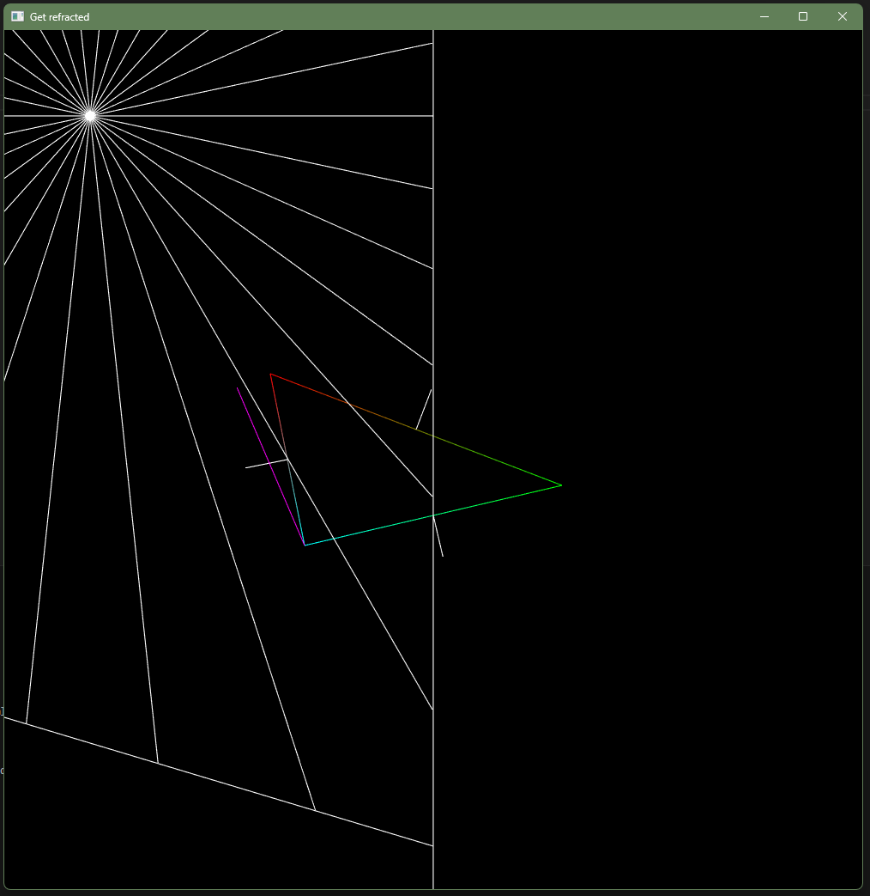

# 2d-optics-sim

A fun little program to provide a simple 2d simulation for refraction and reflection.

---

## *Attention!*

Compiling and executing this program requires SFML. Since I do not have any experience with SFML yet, I will just direct you to the [Tutorial which I used](https://www.youtube.com/watch?v=rZE700aaT5I).

---

## Current State

Functions are in place to find the normal vector of an arbitrary line. Rays emitted by a point source collide with "walls" and do not run any further.
